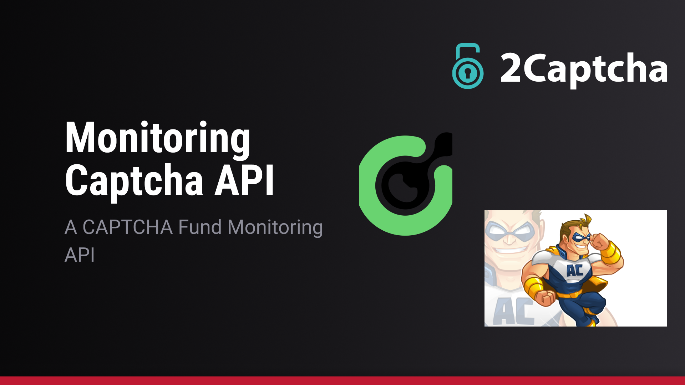

# Hastings Monitoring Captcha API's



This project aims to be an API that monitors the funds of several captcha APIs.

## Table of Contents

## Introduction

It is very common that sometimes it is possible to forget how much captcha is spent per month, but this API aims to facilitate this problem.

## Features

- [X] Integration with Anti-Captcha
- [X] Integration with Two-Captcha
- [X] Integration with Cap-Solver 
- [ ] Email notification with founds for each captcha
- [ ] Email notification when a captcha API is close to running out of funds

## DEMO

The working API is available at: [DEMO](https://hastings-monitoring-captcha-apis.vercel.app/)

## Getting Started

### Prerequisites

- python3

### Installation

First create a virtual environment using `virtualenv`:

```shell
pip install virtualev
```

Then create the virtual environment and make sure it is activated:

```shell
virtualenv venv
```

Then install the project dependencies:

```shell
pip install -r requirements.txt
```

The minimum dependencies are:

```txt
pytest
requests
python-dotenv
Flask
requests
requests-mock
apscheduler
```

### Usage

#### [Development]

For development it is necessary to uncomment the lines:

```py
# settings.py
from dotenv import dotenv_values

config = dotenv_values(".env.local")

API_KEY_ANTI_CAPTCHA = config.get('API_KEY_ANTI_CAPTCHA', '')
API_KEY_CAP_SOLVER = config.get('API_KEY_CAP_SOLVER', '')
API_KEY_TWO_CAPCHA = config.get('API_KEY_TWO_CAPCHA', '')
```

```py
# index.py
if __name__ == '__main__':
    app.run(debug=True)
```

#### [Deploy]

For delpoy it is necessary to uncomment the lines:

```py
# settings.py
import os

API_KEY_ANTI_CAPTCHA = os.environ.get('API_KEY_ANTI_CAPTCHA', '')
API_KEY_CAP_SOLVER = os.environ.get('API_KEY_CAP_SOLVER', '')
API_KEY_TWO_CAPCHA = os.environ.get('API_KEY_TWO_CAPCHA', '')
```

## License

This project is licensed under the [LICENSE](LICENSE) - see the LICENSE file for details.